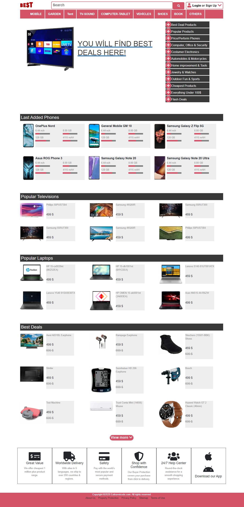

# BEST WEBSİTE

This is a capstone project at the end of the HTML and CSS curriculum. Before this project; I used different kind of tools and resources for each HTML unit. After 2 long months, I arrived to the one of the best part of being in coding training adventure. This project contains mix of last 7 projects in repository. "BEST" web is a shopping website. This website includes, products of; Mobile phone, Laptop, Computer, Television, Home Design, Jewerly, Outdoor sports.

After few months later; this project will be real life website which sells tech products for local people in the country where I live.

## Project Description

- İn the main navbar you can look in categories directly what you need
- This website based on shopping for electronics. But also you can find some personal products
- İn " Last Added Phones " section there is a progress bar which shows you best price&perform product in this website.
- Result page has filter. This filter eleminates useless products for you in showcase and you can find best deal for you.
- Each produch has transition hover efect. This increases your focus on the item.
- Both page has 'View More' link. When you click this link; other related items appears on the page.

## Built With

- Bootstrap grid system
- Bootstrap positioning
- Responsive media queries for all screen sizes
- CSS grid & flexbox system
- Box model
- Semantic HTML
- Unique HTML tags

## Live Demo

[Live](https://rawcdn.githack.com/mcihadkurel/HTML-capstone-project/023bc227a993cf0af7328578d33da35428511119/index.html)

## Instructions
** For run this project **
- Clone this repository on your desktop
- Make sure you are in right folder to check code
- Click index.html and open it in live browser
- You can wiew this project in any browser

👤 **Muhammed Cihad Kurel**

- Github: [@mcihadkurel](https://github.com/mcihadkurel)
- Twitter: [@mece_ka](https://twitter.com/mece_ka)
- LinkedIn: [@muhammed](https://www.linkedin.com/in/muhammed-cihad-8187581a8/)

## 🤝 Contributing

Contributions, issues and feature requests are welcome!

Feel free to check the [issues page](issues/).

## Show your support

Give a ⭐️ if you like this project!

## Acknowledgments

- Hat tip to anyone whose code was used
- Inspiration
- etc

## 📝 License

This project licensed by eattravelcode.com
